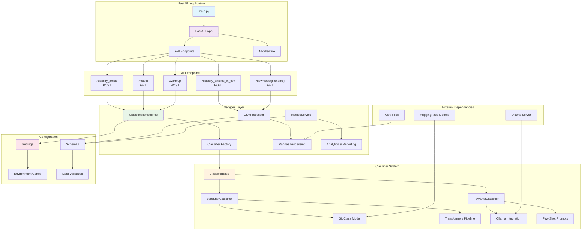
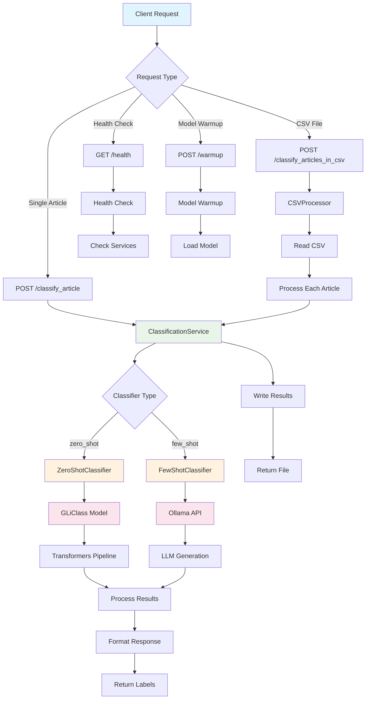

# Article Label Maker

A multi-label classification system for scientific articles built with modern web technologies and AI-powered development tools.

## 🏗️ Backend Architecture



## 🔄 Classification Flow



## 🚀 Overview

Article Label Maker is a full-stack application that classifies scientific articles into multiple categories using machine learning. The system provides both a web interface for manual article classification and batch processing capabilities for CSV files.

## 🛠️ Technology Stack

### Backend
- **FastAPI** - Modern Python web framework for building APIs
- **Python 3.11** - Latest stable Python version
- **uv** - Fast Python package manager and installer
- **Pandas** - Data manipulation and analysis
- **Pydantic** - Data validation using Python type annotations
- **Uvicorn** - ASGI server for running FastAPI applications

### Frontend
- **Next.js 15** - React framework for production
- **React 19** - Latest React version
- **TypeScript** - Type-safe JavaScript
- **Tailwind CSS** - Utility-first CSS framework
- **Radix UI** - Accessible component primitives
- **Lucide React** - Beautiful icons

### Development Tools
- **Docker & Docker Compose** - Containerization and orchestration
- **v0** - AI-powered UI development platform
- **Cursor** - AI-enhanced code editor
- **Git** - Version control

## 📋 Prerequisites

Before running the application, ensure you have the following installed:

- **Docker Engine** (version 20.10 or later)
- **Docker Compose** (version 2.0 or later)

## 🚀 Quick Start

### 1. Clone the Repository
```bash
git clone <repository-url>
cd article-label-maker
```

### 2. Build and Start Services
```bash
docker-compose up --build
```

### 3. Access the Application
- **Frontend**: http://localhost:3000
- **API Documentation**: http://localhost:8000/docs
- **API Health Check**: http://localhost:8000/health

## 📁 Project Structure

```
article-label-maker/
├── api/                    # FastAPI backend
│   ├── main.py            # FastAPI application entry point
│   ├── schemas.py         # Pydantic data models
│   ├── services.py        # Business logic services
│   ├── csv_processor.py   # CSV file processing
│   ├── metrics_service.py # Model performance metrics
│   ├── pyproject.toml     # Python dependencies
│   ├── Dockerfile         # Backend container configuration
│   └── .dockerignore      # Docker ignore rules
├── frontend/              # Next.js frontend
│   ├── app/               # Next.js app directory
│   ├── components/        # React components
│   ├── services/          # API service layer
│   ├── package.json       # Node.js dependencies
│   ├── Dockerfile         # Frontend container configuration
│   └── .dockerignore      # Docker ignore rules
├── docker-compose.yml     # Service orchestration
└── README.md             # This file
```

## 📊 Features

### Article Classification
- **Single Article**: Manual input of title and abstract
- **Batch Processing**: Upload CSV files with multiple articles
- **Multi-label Support**: Articles can belong to multiple categories

### Supported Categories
- Cardiovascular
- Neurological
- Hepatorenal
- Oncological

## 🔌 API Endpoints

### Core Endpoints

| Method | Endpoint | Description | Request Body | Response |
|--------|----------|-------------|--------------|----------|
| `GET` | `/` | Health check | - | Status message |
| `GET` | `/health` | Service health | - | Health status |
| `POST` | `/classify_article` | Classify single article | `ArticleRequest` | `ArticleResponse` |
| `POST` | `/classify_articles_in_csv` | Process CSV file | `multipart/form-data` | `CSVResponse` |
| `GET` | `/download/{filename}` | Download processed CSV | - | File download |

## 👥 Authors

- **Cesar Alfredo Uribe Leon**
- **David Giraldo Villa** 
- **Santiago Cano Duque**

---
